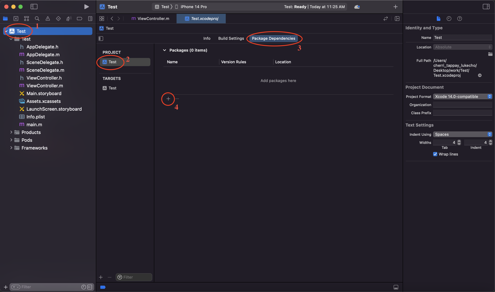
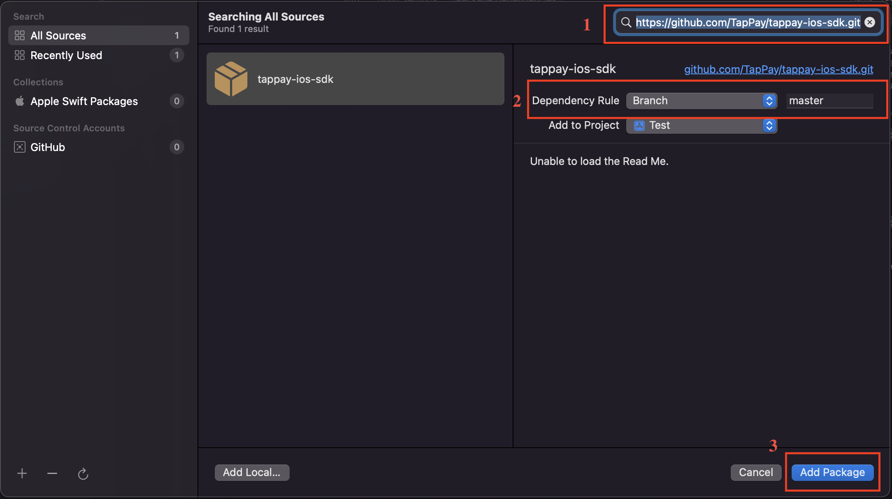
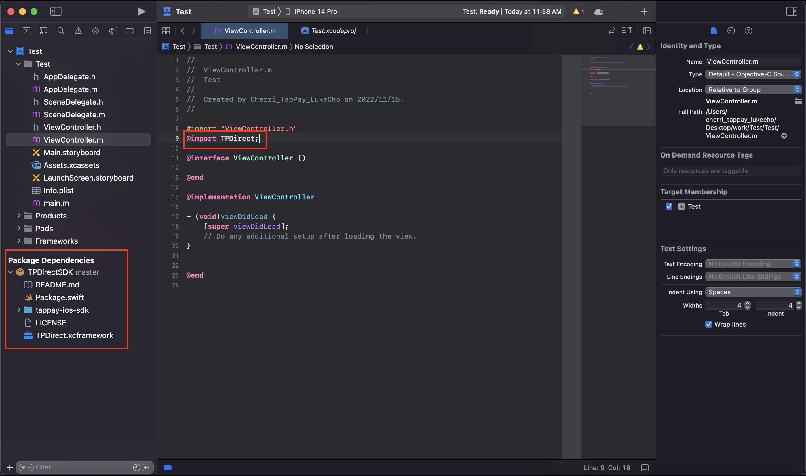

# tappay-ios-sdk

### The TapPay iOS SDK helps you build customizable payments into your iOS app

---

## How to install

The TapPay iOS SDK is open source, and provided by the following methods

#### [1. Manual Framework](#manual)
#### [2. Swift Package](#package)

---

## How to use the methods in SDK

> Please refer to the example page [tappay-ios-example](https://github.com/TapPay/tappay-ios-example)

---

## Manual Framework
> a. Download the TPDirect.xcframework.zip from  [releases page](https://github.com/TapPay/tappay-ios-sdk/releases)  and unzip it  
> b. Drag TPDirect.xcframework to the "Frameworks, Libraries and Embedded Content" section of the General settings in your Xcode project. Make sure to select Copy items if needed.

***

## Swift Package

> a. Follow the steps of the image to add a new package dependency   
   
> b. Enter https://github.com/TapPay/tappay-ios-sdk.git as the repository URL and set it as master branch   
   
> c. Click add package   
   
> d. If the installation is success, then the package will appear in the side menu, and you can use the SDK by adding "@import TPDirect;"   

