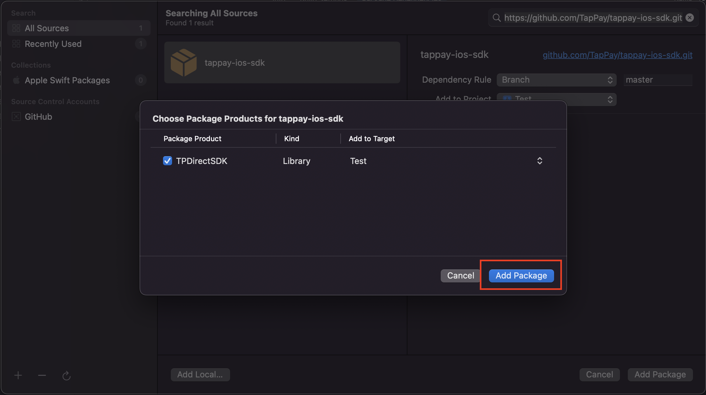

# tappay-ios-sdk

### TapPay provides the following methods to let developers install TPDirect SDK into their projects

---

## How to install

### 1. Download TPDirect.xcframework directly
### [2. Cocoapods](#cocoapods)
### [3. Swift Package](#package)

---

## How to use the mehods in SDK

> Please refer to the exmaple page [tappay-ios-example](https://github.com/TapPay/tappay-ios-example)

***
<a name="cocoapods"></a>
## Cocoapods
> a. Open the terminal and cd to the root path of the project which will be installed SDK. <br>
> b. Create Podfile by the following command
```
pod init
```
> c. Modify the content of Podfile like following
```
# Uncomment the next line to define a global platform for your project
# platform :ios, '9.0'

source 'https://github.com/TapPay/tappay-ios-sdk.git'

target 'Test' do
  # Comment the next line if you don't want to use dynamic frameworks
  use_frameworks!

  pod 'tappay-ios-sdk'

  # Pods for Test

end

# Replace 'Test' with the project name, like 'ProjectXXX'
```
> d. Then use the following command to install SDK
```
pod install
```
> e. Finally the SDK is available for the project by using the .xcwrokspace file

***
<a name="package"></a>
## Swift Package

> a. Follow the steps of the image to add a new package dependency <br><br>
 <br><br>
> b. Input the url of this repository, then change the "Dependency Rule" to "Branch" and set it as master branch <br><br>
 <br><br>
> c. Click add package <br><br>
 <br><br>
> d. If the installation is success, then the package will appear in the side menu, and you can use the SDK by adding "@import TPDirect;" <br><br>

